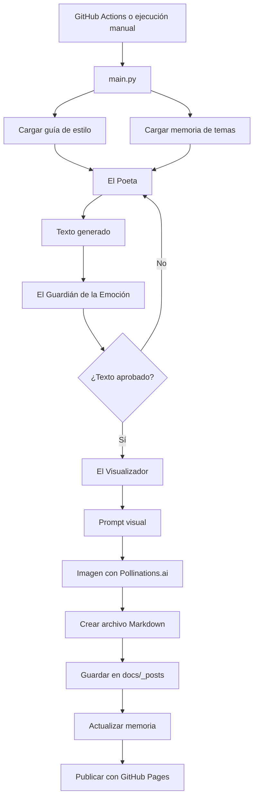

# Ecos del Alma

Sistema de escritura generativa que crea, revisa, ilustra y publica textos poéticos breves de forma automática.


## Demo

- **Web:** https://faridSprado.github.io/ecos-del-alma/
- **Repositorio:** https://github.com/faridSprado/ecos-del-alma.git

## Sobre el proyecto

**Ecos del Alma** nació como un experimento personal para explorar cómo usar inteligencia artificial de una forma más estructurada que simplemente pedirle textos a un modelo.

La idea es simple: crear un sistema que pueda escribir publicaciones poéticas breves, revisarlas, generar una imagen relacionada y publicarlas en una web sin tener que hacerlo todo manualmente cada vez.

El proyecto trabaja con tres partes principales:

- **El Poeta**, que genera el texto.
- **El Guardián de la Emoción**, que revisa si el texto mantiene el tono, evita clichés y cumple la guía de estilo.
- **El Visualizador**, que crea una imagen atmosférica para acompañar la publicación.

Cada texto se genera a partir de una guía de estilo propia y de una pequeña memoria que ayuda a no repetir los mismos temas todo el tiempo.

## Qué hace

El flujo completo es este:

1. Se carga la guía de estilo del proyecto.
2. Se revisan los temas usados recientemente.
3. El sistema elige un tema para el nuevo escrito.
4. El Poeta genera un texto breve.
5. El Guardián de la Emoción lo evalúa.
6. Si el texto no cumple, se vuelve a intentar.
7. Si el texto es aprobado, se genera una imagen relacionada.
8. Se crea una publicación en Markdown.
9. Se guarda en `docs/_posts/`.
10. GitHub Pages publica el contenido en la web.

## Arquitectura



## Guía de estilo

La base creativa está en:

```text
biblia/guia_estilo.json
```

Ahí se define la identidad del proyecto:

- tono general;
- tipo de textos;
- temas disponibles;
- longitud esperada;
- recursos literarios permitidos;
- estilos o frases que se deben evitar;
- estructura sugerida para cada escrito.

Algunos temas incluidos son:

- amor consciente;
- despedidas y duelos;
- soledad fértil;
- esperanza realista;
- vínculos humanos.

La guía permite que los textos mantengan una línea parecida, aunque cada publicación sea diferente.

## Agentes

### El Poeta

Genera el escrito principal a partir del tema elegido y de la guía de estilo.

Su objetivo es crear textos breves, emocionales y fáciles de conectar con experiencias cotidianas, evitando sonar genérico o demasiado forzado.

### El Guardián de la Emoción

Funciona como una revisión editorial automática.

Evalúa si el texto:

- evita clichés;
- usa imágenes concretas;
- mantiene el tono del proyecto;
- se siente natural;
- respeta las restricciones de la guía.

Si el texto no pasa la revisión, el sistema genera otro intento.

### El Visualizador

Toma el texto aprobado y crea un prompt visual en inglés. Con ese prompt se genera una imagen usando Pollinations.ai.

La intención no es crear una imagen literal, sino una pieza visual que acompañe el ambiente del escrito.

## Estructura del proyecto

```text
ecos-del-alma/
├── .github/
│   └── workflows/
│       └── daily-fabula.yml
├── agentes/
│   └── agentes.py
├── biblia/
│   └── guia_estilo.json
├── docs/
│   ├── _config.yml
│   ├── index.md
│   ├── _layouts/
│   │   ├── default.html
│   │   └── post.html
│   └── _posts/
├── memoria/
│   ├── estado_publicacion.json
│   └── temas_usados.json
├── main.py
├── requirements.txt
├── .gitignore
└── README.md
```

## Tecnologías usadas

- **Python 3.11+** para orquestar el flujo.
- **Groq API** para generar y revisar textos.
- **Llama 3.3 70B Versatile** como modelo principal.
- **Pollinations.ai** para generar imágenes desde una URL.
- **Markdown + Jekyll** para crear las publicaciones.
- **GitHub Pages** para publicar la web.
- **GitHub Actions** para automatizar la ejecución.
- **JSON** para la guía de estilo y la memoria del sistema.

## Instalación local

### 1. Clonar el repositorio

```bash
git clone https://github.com/faridSprado/ecos-del-alma.git
cd ecos-del-alma
```

### 2. Crear un entorno virtual

En Windows PowerShell:

```bash
python -m venv venv
.\venv\Scripts\Activate.ps1
```

Si PowerShell bloquea la activación:

```bash
Set-ExecutionPolicy -ExecutionPolicy RemoteSigned -Scope CurrentUser
.\venv\Scripts\Activate.ps1
```

### 3. Instalar dependencias

```bash
pip install -r requirements.txt
```

### 4. Crear el archivo `.env`

En la raíz del proyecto, crear un archivo llamado `.env` con este contenido:

```env
GROQ_API_KEY=gsk_tu_clave_de_groq
```

Este archivo no se debe subir a GitHub.

### 5. Ejecutar el proyecto

```bash
python main.py
```

Si todo está bien configurado, se generará una nueva publicación dentro de:

```text
docs/_posts/
```

## Automatización

El proyecto incluye un workflow de GitHub Actions en:

```text
.github/workflows/daily-fabula.yml
```

Ese workflow se encarga de:

1. descargar el código del repositorio;
2. instalar Python y las dependencias;
3. ejecutar `python main.py`;
4. guardar el nuevo escrito;
5. actualizar la memoria;
6. hacer commit y push de los cambios.

Para que funcione en GitHub, hay que crear un secreto llamado:

```text
GROQ_API_KEY
```

Ruta en GitHub:

```text
Settings > Secrets and variables > Actions > New repository secret
```

## GitHub Pages

La web está pensada para publicarse desde la carpeta:

```text
docs/
```

Configuración recomendada:

- **Source:** Deploy from a branch
- **Branch:** main
- **Folder:** /docs

URL del proyecto:

```text
https://faridSprado.github.io/ecos-del-alma/
```

## Ejemplo de publicación

```markdown
---
layout: post
title: "Vínculos humanos"
date: 2026-05-10 08:00:00 -0000
categories: ecos-del-alma
tema: Vínculos humanos
image: https://image.pollinations.ai/prompt/...
---

A veces alguien llega sin hacer ruido.
No trae respuestas.
Trae una silla, una tarde, una forma distinta de quedarse.

Y uno aprende que hay refugios que no tienen paredes,
solo una voz diciendo:
respira, estoy aquí.
```

## Ideas pendientes

Algunas mejoras que me gustaría agregar más adelante:

- generar imágenes cuadradas listas para Instagram;
- poner texto sobre la imagen automáticamente;
- crear varias líneas editoriales;
- guardar la puntuación emocional de cada texto;
- agregar filtros por tema;
- mejorar el diseño visual de la web;
- generar un feed RSS;
- publicar automáticamente en redes sociales.

## Autor

**Farid Prado**

Proyecto personal de escritura generativa, automatización creativa e inteligencia artificial aplicada.
